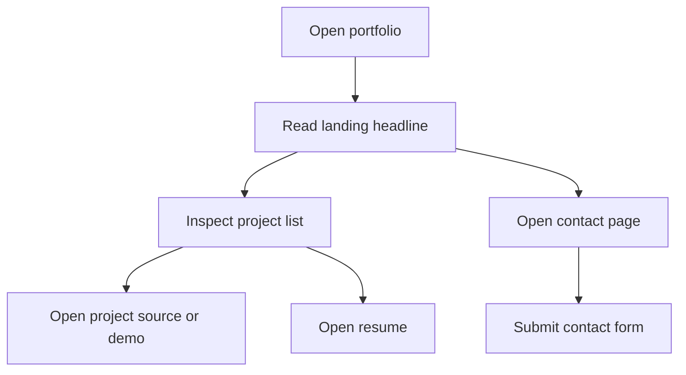
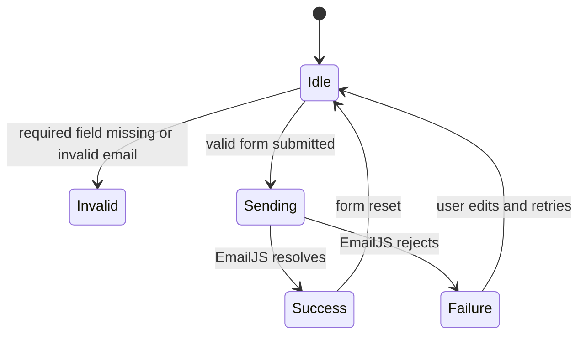
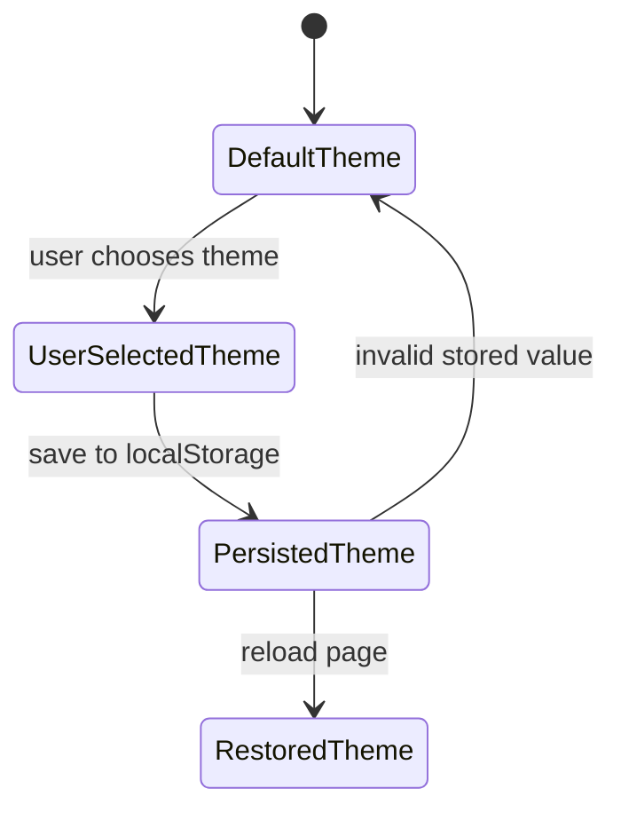
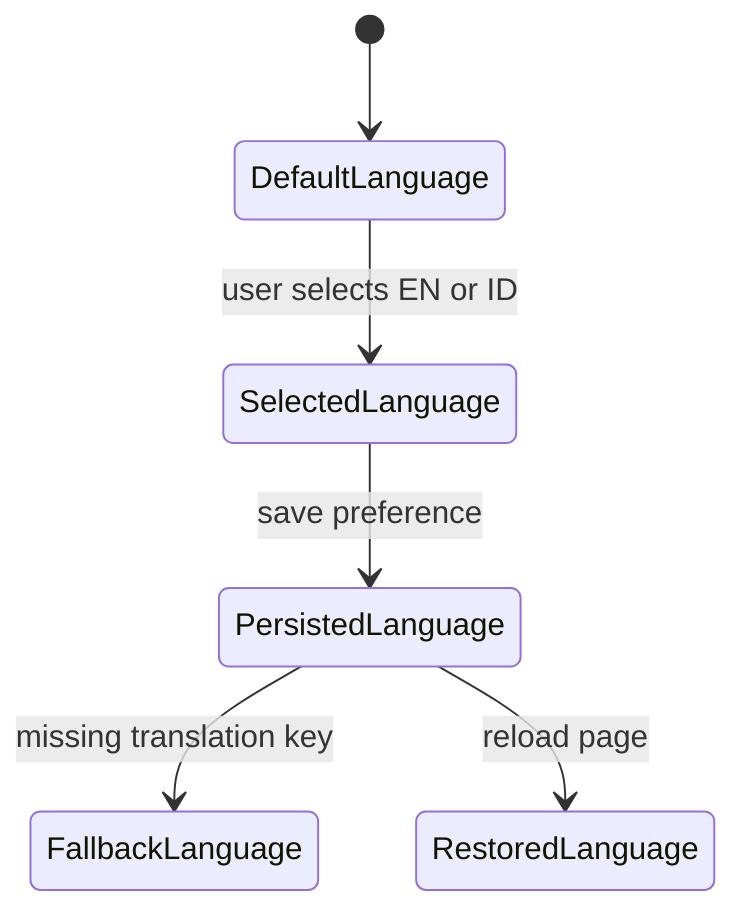

# UI/UX Flows

## Primary Recruiter Flow

## Contact Form State Flow

## Routing Flow

Routes currently expected by the Angular app:

| Path | Page | Expected behavior |
|---|---|---|
| `/` | Main / Landing | Shows primary introduction and navigation paths. |
| `/about-me` | About Me | Shows background, experience, education, and interests. |
| `/portfolio` | Portfolio | Shows project list and external links when available. |
| `/contact` | Contact | Shows contact form, WhatsApp link, email link, and submission feedback. |
| `/**` | Fallback | Redirects to `/`. |

## Theme Selector Flow

## Language Selector Flow

