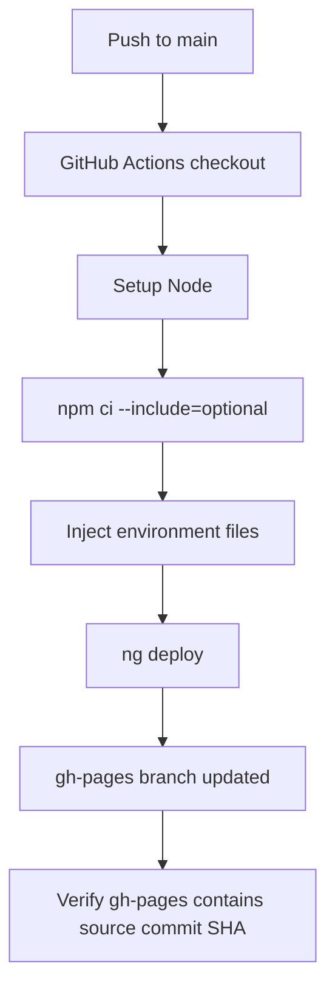

# Deployment Architecture

## Runtime Model

The application is built as static Angular assets and deployed to GitHub Pages using `angular-cli-ghpages` through GitHub Actions.

## Build Inputs

- Node.js 20.19.5 in GitHub Actions.
- `npm ci --include=optional` for deterministic dependency installation with optional native packages.
- Angular production build through `ng deploy`.
- EmailJS environment values injected during workflow execution.

## Deployment Flow

## Required Verification

- `npm ci --include=optional` succeeds.
- Production build succeeds.
- `gh-pages` branch update is verified against the source commit SHA.
- Custom domain remains configured through CNAME.
- Deployed site loads the home route and direct navigation routes.

## Rollback Procedure

1. Identify the last known good `gh-pages` commit.
2. Revert or redeploy from the last known good source commit.
3. Verify home, portfolio, contact form display, and asset loading.
4. Record rollback reason in the related issue or PR.
