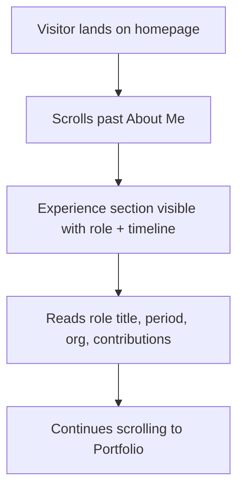

# Feature Specification: F004 — Professional Experience Section

Feature ID: F004
GitHub Issue: TBD
Status: In Progress

## Problem

The portfolio shows projects and skills but gives no context about where Muhammad Alif Budiman
has applied those skills professionally. Recruiters and collaborators need to see real
internship and MSIB experience with role context, dates, and contributions — not just project
cards that lack employment attribution.

## Goal

Render a dedicated Professional Experience section on the homepage between About Me and Portfolio.
Each entry shows role, period, organisation, location, description, and a contributions list.
All copy is bilingual via the existing LanguageService.

## Non-Goals

- No external API fetch for employment data; data lives in a typed model.
- No PDF parsing or LinkedIn sync.
- Does not replace the About Me bio.

## Users

- Primary user: Recruiter or technical hiring manager scanning the portfolio.
- Secondary user: Collaborator or client evaluating relevant professional background.

## User Flow

## Functional Requirements

| ID | Requirement |
|---|---|
| FR-F004-1 | Experience section renders on the homepage between the About Me and Portfolio sections. |
| FR-F004-2 | Each entry shows: role/title, employment period (start–end), organisation name, location, short description, and a bulleted contributions list. |
| FR-F004-3 | All displayed text (labels, descriptions, contributions) is bilingual (EN/ID) via the existing LanguageService. |
| FR-F004-4 | Section uses a semantic heading hierarchy (`<h2>` for the section title, `<h3>` for each entry); meets WCAG AA contrast; is keyboard-scannable without mouse. |

## Non-Functional Requirements

| ID | Requirement | Target |
|---|---|---|
| NFR-F004-1 | Section does not introduce layout shift or block LCP. | CLS < 0.1, no render-blocking resource |
| NFR-F004-2 | Component is standalone and lazy-loadable alongside existing page sections. | Matches existing Angular standalone pattern |

## Acceptance Criteria

| ID | Given | When | Then |
|---|---|---|---|
| AC-F004-1 | A visitor opens the homepage | the page loads | the Experience section appears between About Me and Portfolio |
| AC-F004-2 | An entry is rendered | the current language is EN | role, period, location, description, and contributions are shown in English |
| AC-F004-3 | An entry is rendered | the user switches to ID | all text updates to Indonesian without page reload |
| AC-F004-4 | A keyboard user Tabs through the section | the section has no interactive controls | the heading and content are reachable via the document outline; no focus traps introduced |

## Clarifications

None. Spec is stable for implementation.
