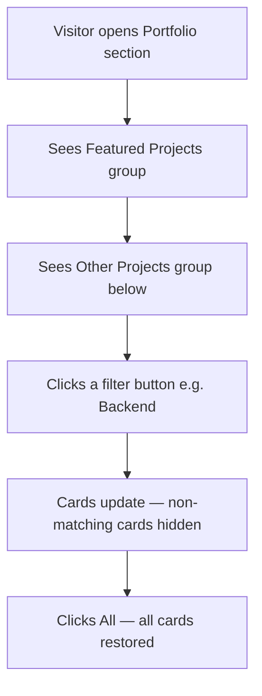

# Feature Specification: F005 — Project Taxonomy, Featured Hierarchy & Filtering

Feature ID: F005
GitHub Issue: TBD
Status: In Progress

## Problem

The current portfolio renders all projects as a flat, unordered list. There is no way for a
visitor to distinguish featured backend/full-stack work from learning or experimental projects,
and no way to filter by category. This buries the most relevant work for a recruiter evaluating
backend or full-stack capability.

## Goal

Extend the project data model with taxonomy tags, split the portfolio into Featured and Other
Projects groups, and add an accessible filter bar so visitors can narrow by category without a
page reload.

## Non-Goals

- No server-side search or pagination.
- No user-editable tag system.
- Does not introduce a new route (all changes are within the portfolio section/page).

## Users

- Primary user: Recruiter or technical evaluator assessing project depth.
- Secondary user: Collaborator browsing by technology category.

## User Flow

## Functional Requirements

| ID | Requirement |
|---|---|
| FR-F005-1 | Projects in `src/app/data/projects.data.ts` are tagged with `featured: boolean`, `categories: string[]`, `year?: number`, and `links: ProjectLink[]` in the typed model. |
| FR-F005-2 | Portfolio view renders two groups: "Featured Projects" (featured === true) above "Other Projects" (featured === false). |
| FR-F005-3 | A filter bar with options All / Featured / Backend / Full-Stack / Frontend / Learning / Restricted updates the visible cards reactively without page reload. |
| FR-F005-4 | Filter buttons use `aria-pressed="true/false"` to communicate selected state; the active filter is visually distinct from inactive filters. |
| FR-F005-5 | Each card displays: role, year, category badge(s), access-status chip (live / restricted / unavailable), stack badges, and multi-CTA links. |
| FR-F005-6 | Restricted or unavailable project links are rendered as disabled (`<button disabled>` or `<a aria-disabled="true">`) with no `href="#"` fallback. |

## Non-Functional Requirements

| ID | Requirement | Target |
|---|---|---|
| NFR-F005-1 | Filter interaction produces no perceptible layout shift. | CLS contribution < 0.05 |
| NFR-F005-2 | Data model changes are backward-compatible with existing card rendering. | No regressions in existing tests |

## Acceptance Criteria

| ID | Given | When | Then |
|---|---|---|---|
| AC-F005-1 | The portfolio section is open | the page loads | Featured Projects group is visible above Other Projects |
| AC-F005-2 | The filter bar is rendered | the user selects "Backend" | only projects with `categories` including "Backend" are shown |
| AC-F005-3 | A filter button is active | any state | the button has `aria-pressed="true"` and a visually distinct style |
| AC-F005-4 | A restricted project card is rendered | any filter | links for that project are disabled and do not navigate |
| AC-F005-5 | The user selects "All" | any prior filter active | all project cards are restored |

## Clarifications

None. Spec is stable for implementation.
