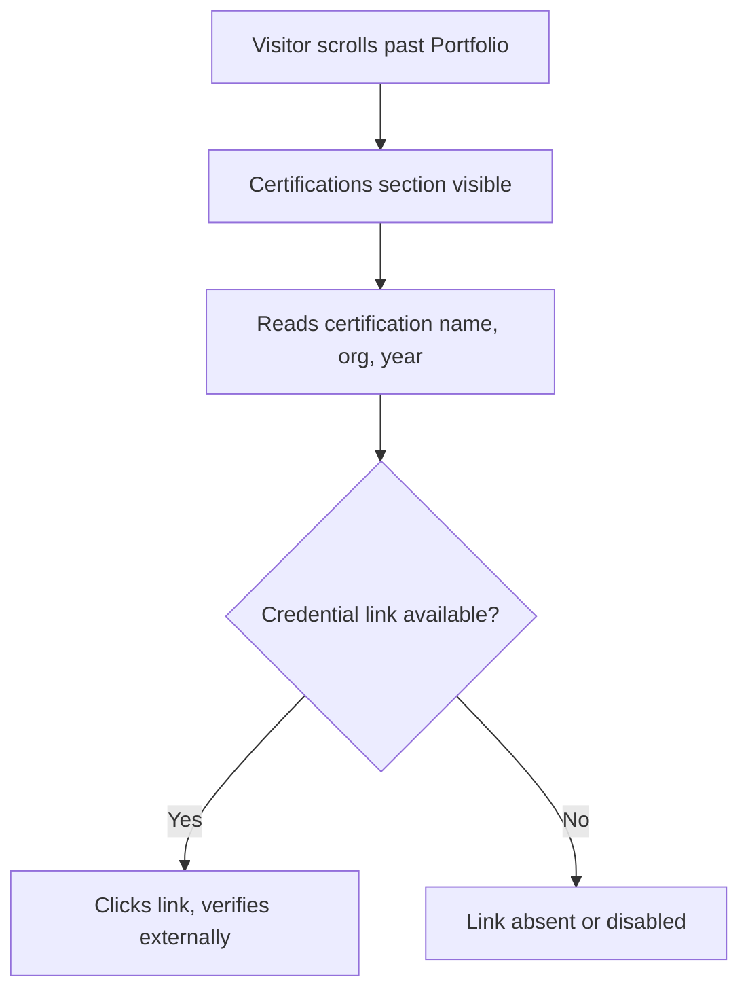

# Feature Specification: F006 — Certifications Section

Feature ID: F006
GitHub Issue: TBD
Status: In Progress

## Problem

Muhammad Alif Budiman holds verifiable certifications from the LearningX MSIB programme and the
BKN internship. These credentials are not surfaced anywhere on the portfolio, which weakens
credibility for recruiters who look for formal programme completions alongside project evidence.

## Goal

Display a Certifications section after the Portfolio section. Each entry shows the certification
name, issuing organisation, year, and a credential link where one exists. Only verified,
real certificates are listed — no fabricated credential IDs or metrics.

## Non-Goals

- No automated certificate fetch or badge API integration.
- Does not display certificates that have not been verified by the owner.
- Does not generate PDF certificates.

## Users

- Primary user: Recruiter or evaluator verifying formal programme completions.
- Secondary user: Collaborator assessing structured training background.

## User Flow

## Functional Requirements

| ID | Requirement |
|---|---|
| FR-F006-1 | Certifications section renders two verified entries: (1) LearningX MSIB Full-Stack Web Development (2023); (2) BKN Internship (2026). |
| FR-F006-2 | Only verified certificates are shown; no fabricated credential IDs, scores, or metrics are added. |
| FR-F006-3 | If no credential URL is available for an entry, the credential link element is absent or rendered as disabled — not a placeholder `href="#"`. |
| FR-F006-4 | All displayed copy (section title, labels, descriptions) is bilingual (EN/ID) via the existing LanguageService. |

## Non-Functional Requirements

| ID | Requirement | Target |
|---|---|---|
| NFR-F006-1 | Section does not introduce external runtime dependencies beyond LanguageService. | Static data only |
| NFR-F006-2 | External credential links use `rel="noopener noreferrer"` and `target="_blank"`. | Security baseline (F00F) |

## Acceptance Criteria

| ID | Given | When | Then |
|---|---|---|---|
| AC-F006-1 | A visitor scrolls past Portfolio | the page loads | the Certifications section is visible with both verified entries |
| AC-F006-2 | An entry has no credential URL | the card is rendered | no href link is rendered for that entry |
| AC-F006-3 | The user switches to Indonesian | LanguageService emits ID | all Certifications copy updates to Indonesian |
| AC-F006-4 | A credential link is present | the user clicks it | the link opens in a new tab with `rel="noopener noreferrer"` |

## Clarifications

None. Spec is stable for implementation.
