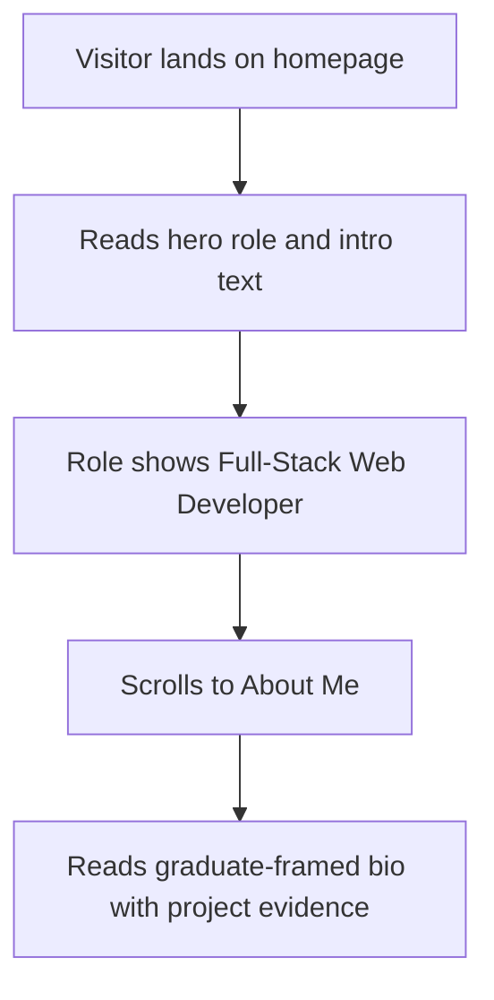

# Feature Specification: F007 — Professional Positioning & Copy Refresh

Feature ID: F007
GitHub Issue: TBD
Status: In Progress

## Problem

Existing hero and about copy describes Muhammad Alif Budiman as "studying Informatics",
which is no longer accurate following graduation. The current role label and bio copy do
not reflect full-stack and backend positioning, real project experience, or the internship
and MSIB background. SEO metadata and structured data carry the outdated student framing.

## Goal

Replace student wording throughout hero, about, and SEO metadata with graduate +
full-stack/backend positioning. All copy changes must be grounded in real, verifiable
project or internship evidence — no inflated claims or fabricated credentials.

## Non-Goals

- Does not change the visual layout or component structure beyond copy updates.
- Does not introduce new Angular components (copy lives in translation files and index.html).
- Does not alter SEO metadata structure introduced by F00I — only values are updated.

## Users

- Primary user: Recruiter or technical evaluator reading the hero and about sections.
- Secondary user: Search engine crawler indexing the page metadata.

## User Flow

## Functional Requirements

| ID | Requirement |
|---|---|
| FR-F007-1 | `intro.role` translation key is updated to "Full-Stack Web Developer" in `en.json` and the equivalent in `id.json`. |
| FR-F007-2 | `intro.body` (hero paragraph) no longer contains "studying Informatics"; copy reflects CS graduate status and references backend API and workflow systems experience. |
| FR-F007-3 | `about.p1`, `about.p2`, `about.p3` are rewritten to reflect graduate status with real project and internship evidence; no fabricated claims or metrics are added. |
| FR-F007-4 | All `seo.*` translation keys (title, description) are updated to match the new positioning in both EN and ID. |
| FR-F007-5 | `src/index.html` static `<title>`, `<meta name="description">`, OG tags, Twitter tags, and JSON-LD `jobTitle` are updated to reflect Full-Stack / Backend Web Developer positioning. |

## Non-Functional Requirements

| ID | Requirement | Target |
|---|---|---|
| NFR-F007-1 | No fabricated job titles, companies, or metrics are introduced. | Owner-verified copy only |
| NFR-F007-2 | All changed translation keys remain present in both `en.json` and `id.json` with non-empty values. | LanguageService fallback not triggered |

## Acceptance Criteria

| ID | Given | When | Then |
|---|---|---|---|
| AC-F007-1 | A visitor opens the homepage | the page loads in EN | Hero role label reads "Full-Stack Web Developer" |
| AC-F007-2 | A visitor opens the homepage | the page loads in EN | Hero intro text contains no reference to "studying Informatics" |
| AC-F007-3 | A visitor opens the About Me section | the page is in EN | Bio paragraphs reference CS graduate status and real project/internship experience |
| AC-F007-4 | A crawler indexes the page | the page is served | `<title>`, meta description, OG, and JSON-LD reflect updated positioning |
| AC-F007-5 | A visitor switches to ID | LanguageService emits ID | Role, intro, and bio copy are fully localised; no EN strings visible |

## Clarifications

None. Spec is stable for implementation. All copy must be confirmed by the owner before
committing to avoid fabricated claims.
