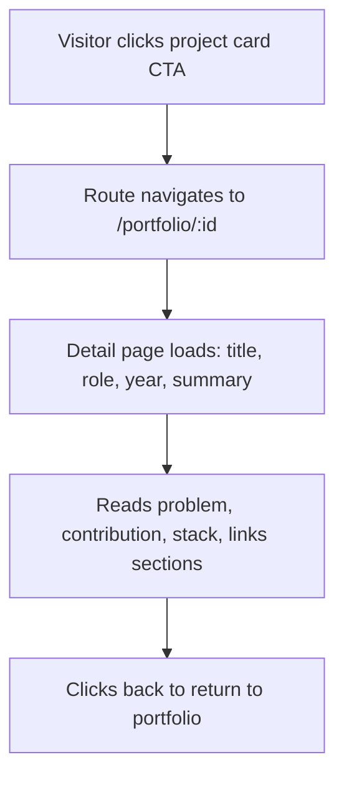

# Feature Specification: F008 — Project Detail / Case-Study Route

Feature ID: F008
GitHub Issue: TBD
Status: Planned (Deferred — implementation deferred to Phase 6)

## Problem

The portfolio section shows summary cards but provides no way for a visitor to read a deeper
case study: problem context, individual contribution, technical implementation details, and
lessons learned. Recruiters who want more than a one-liner must navigate away or ask directly.

## Goal

Add `/portfolio/:id` detail pages with structured sections: problem/context, contribution,
technical implementation, and links. All content must be truthful, non-confidential, and
bilingual.

## Non-Goals

- Not implemented in the current branch. Deferred to Phase 6.
- Does not include a CMS or runtime content API.
- BKN detail content is anonymised and contains no confidential government data.

## Users

- Primary user: Recruiter or technical evaluator wanting a deep-dive on a specific project.
- Secondary user: Collaborator reviewing contribution scope and technical decisions.

## User Flow

## Functional Requirements

| ID | Requirement |
|---|---|
| FR-F008-1 | Route `/portfolio/:id` resolves a project by its `id` field from the data model. |
| FR-F008-2 | Detail page renders: title, role, year, summary, problem/context, contribution, stack, and links sections. |
| FR-F008-3 | BKN project detail page uses only anonymised, non-confidential content — no client-specific data or internal system details. |
| FR-F008-4 | All page copy is bilingual via LanguageService; navigation labels and section headings localised in EN and ID. |

## Non-Functional Requirements

| ID | Requirement | Target |
|---|---|---|
| NFR-F008-1 | Detail route is lazy-loaded to avoid increasing initial bundle size. | Separate chunk in build output |
| NFR-F008-2 | Unknown `:id` values redirect to `/portfolio` with no 404 thrown. | Angular route guard or resolver |

## Acceptance Criteria

| ID | Given | When | Then |
|---|---|---|---|
| AC-F008-1 | A project card has a "View Details" CTA | the user activates it | the route navigates to `/portfolio/:id` |
| AC-F008-2 | The detail page is open | any project | all required sections are rendered (title, role, year, summary, problem, contribution, stack, links) |
| AC-F008-3 | The BKN detail page is open | the user reads it | no confidential client data, system names, or internal metrics are present |
| AC-F008-4 | An unknown project ID is navigated to | the URL is malformed | the app redirects to `/portfolio` without throwing an error |

## Clarifications

Implementation deferred. Before work begins in Phase 6, confirm:
- Which projects will have full case studies authored.
- Approved non-confidential content for the BKN entry.
- Owner approval of all detail-page copy.
