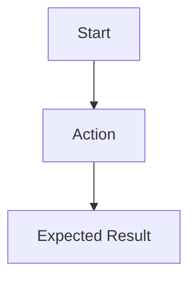

# Feature Specification Template

Feature ID: `Fxxx`
Status: `Draft | Ready | In Progress | Review | Done | Blocked`
GitHub Issue: `#x`

## Problem

Describe the user problem without implementation details.

## Goal

Define the measurable outcome.

## Non-Goals

List what this feature will not solve.

## Users

- Primary user:
- Secondary user:

## User Flow

## Functional Requirements

| ID | Requirement |
|---|---|
| FR-Fxxx-1 | TBD |

## Non-Functional Requirements

| ID | Requirement | Target |
|---|---|---|
| NFR-Fxxx-1 | TBD | TBD |

## Acceptance Criteria

| ID | Given | When | Then |
|---|---|---|---|
| AC-Fxxx-1 | TBD | TBD | TBD |

## Clarifications

Use `[NEEDS CLARIFICATION: question]` for every unresolved requirement. Source-code editing must not start while unresolved clarification markers remain.
